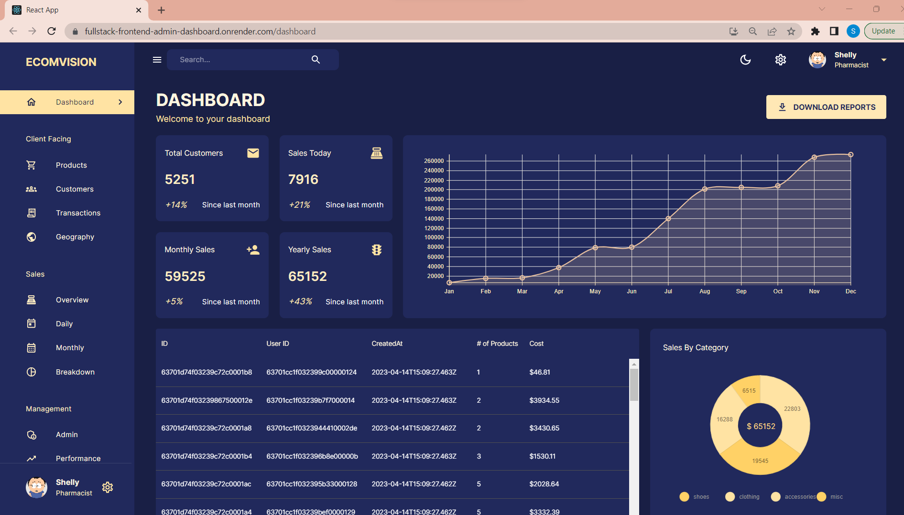

# React Admin Full Stack Dashboard

## Description

This was a project to create a react admin dashboard for business use. The application was used with an emphasis with Redux toolkit queries, Nova graphs, and material mui

## Table of Contents

- [Installation](#installation)
- [Usage](#usage)
- [Contributing](#contributing)
- [Tests](#tests)
- [Questions](#questions)
- [License](#license)

## Installation

    This project can be downloaded from Github:
    https://github.com/samlee088/react-admin-fullStack-dashboard

    Additionally a deployed link can be found here:
    https://fullstack-frontend-admin-dashboard.onrender.com/dashboard

## Usage

This application can be downloaded and deployed separately, as the deployed link will take the user to example data and a user account.

## Contributing

Tutorial with ed-roh

## Tests

NA

## Questions

Please reach me with any of the following:
github.com/sam.lee088
sam.lee088@hotmail.com

## License

WTFPL
[WTFPL License](http://www.wtfpl.net/about/)
